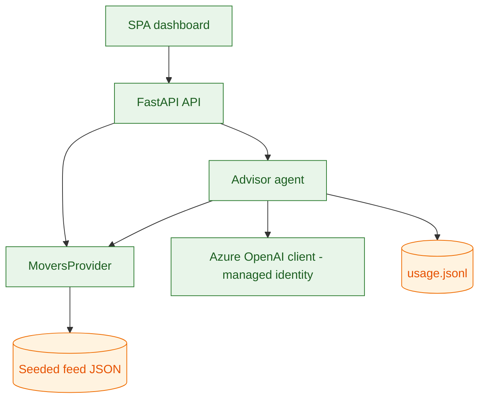
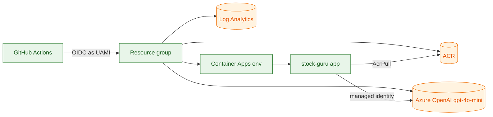
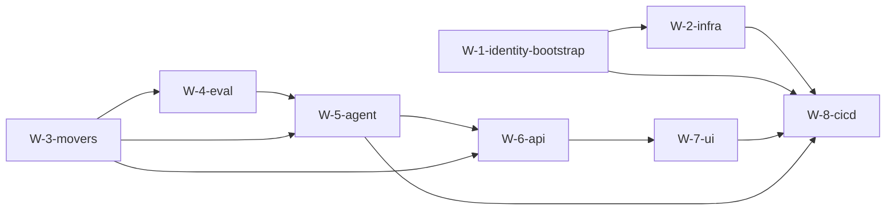

# Plan — Iteration-G2EXH7 · Daily Stock Advisor

Builds on `spec-Iteration-G2EXH7.md`. First iteration — nothing prior to extend.

## Metadata

- **Iteration ID:** Iteration-G2EXH7
- **Specialization:** sdlc-for-agentic-apps
- **Risk level:** 2 + Azure cloud Runtime target
- **Execution pattern:** Sequential (recorded in `meta/execution-pattern`)

## 1. Architecture

### 1.1 Domains and application architecture

Single domain. A Python backend (FastAPI) hosts: the **MCP server** exposing
`get_market_movers` (T-1), the **advisor agent** (`recommend`, T-2), and the
**HTTP API** (`/healthz`, `/api/movers`, `/api/recommend`). A small **SPA**
(static assets served by the backend) is the dashboard. The agent is a bounded
single-step LLM call: it is given the movers (tool context) and returns a
schema-validated, grounded `Watchlist`; grounding and schema are enforced
programmatically after the model returns.

### 1.2 Data architecture

No persistent store. The movers feed is pluggable behind a `MoversProvider`
interface with two implementations: `SeededMoversProvider` (JSON fixture, used in
dev/CI/eval) and a live provider (optional). The in-session profile is passed
per request and never stored. Usage records append to `reports/usage/usage.jsonl`.

### 1.3 Infrastructure architecture

Azure: **Azure Container Apps** (backend container) in a Container Apps
Environment with **Log Analytics**; **Azure Container Registry** (image, managed
-identity pull); **Azure OpenAI** account with a `gpt-4o-mini` deployment. All
provisioned via Bicep under `infra/`. Deploy originates from GitHub Actions over
OIDC (no stored secrets).

### 1.4 Security architecture

- **App-runtime auth (workload identity):** the Container App uses a
  **user-assigned managed identity** to call Azure OpenAI (role: Cognitive
  Services OpenAI User) and to pull from ACR (role: AcrPull). **No API keys** in
  code or config.
- **CI-to-cloud auth (short-lived):** GitHub Actions authenticates via **OIDC**
  to a **user-assigned managed identity** with a **GitHub federated credential**
  (issuer `token.actions.githubusercontent.com`, audience
  `api://AzureADTokenExchange`). The credential **subject MUST match the actual
  token GitHub presents** — this tenant emits an ID-qualified subject
  (`repo:<owner>@<id>/<repo>@<id>:ref:refs/heads/main`); determined via the
  `AADSTS700213` feedback loop during bootstrap (per `config/cloud/azure.md`).
  No long-lived client secrets in CI (three repo **variables** carry
  client/tenant/subscription IDs — identifiers, not secrets).
- **Identity bootstrap (one-time, out-of-band):** the UAMI + federated credential
  + role assignments are declared in Bicep; the first apply runs under the Human
  User's `az login` (CI has no credential yet). The AI Agent **guides the Human
  User** through this one-time step and verifies it (OIDC login green) before
  proceeding. Delivered by `W-1-identity-bootstrap`, sequenced first.
- **No PII / no secrets** in logs or the replay log (core §2 redaction).

### 1.5 Technology choices

- **Backend:** Python 3.12, FastAPI, Uvicorn/Gunicorn. **Frontend:** a single
  static HTML/CSS/vanilla-JS SPA (zero build step) served by the backend — keeps
  the container minimal and accessible.
- **Agentic technology proposal:** agent framework = **none/custom** (direct
  `openai` SDK against Azure OpenAI with **structured outputs** + programmatic
  grounding/schema enforcement — simplest reliable pattern for a bounded,
  single-tool task); model = **Azure OpenAI `gpt-4o-mini`**; orchestration =
  single-step (no multi-agent); tool/MCP = a minimal MCP server exposing T-1;
  eval/guardrail tooling = a custom harness (deterministic scorers + one
  LLM-as-judge dimension); skills = **Impeccable** for the UI.
- **Human User's preferred agentic framework(s):** None stated (Delegated) —
  the AI Agent selected the custom/direct-SDK approach and disclosed it here.

### 1.6 Test architecture

`pytest` unit tests (movers, agent grounding/schema, API) with the seeded feed
and a stubbed model; the **evaluation harness** (`tests/eval/`) scores DIM-1..4
over `cases.jsonl` and writes `reports/eval/`; **safety tests** (`tests/safety/`)
cover disclaimer-drop / invent-ticker / personalized-advice. Model calls are
stubbed where determinism is required; DIM-4 (LLM-judge) runs N=20 at gate time.

### 1.7 Operations architecture

Container Apps provides logs/metrics via Log Analytics. `/healthz` is the
readiness probe; post-deploy smoke = `curl /healthz`. L2 scope — no separate
monitoring/observability stage tasks (3k/3l) beyond platform defaults.

## 2. Design

### 2.1 Application design

- `MoversProvider.get(limit)` → movers; `SeededMoversProvider` reads a fixture.
- `Agent.recommend(profile, movers)` → builds a prompt, calls AOAI with a bounded
  completion + structured output, parses to `Watchlist`, **drops any ticker not
  in movers** (grounding), validates `confidence ∈ [0,1]` and 3–5 items, meters
  tokens/cost, attaches the disclaimer. Fails closed on cost cap / schema.

### 2.2 Data design

`Mover { ticker, name, sector, change_pct, price }`; `RiskProfile { risk,
sectors[] }`; `Recommendation { ticker, rationale, confidence }`;
`Watchlist { watchlist[], disclaimer }`. Usage record `{ request_id, tokens_in,
tokens_out, est_cost_usd, scope, outcome }`.

### 2.3 Infrastructure design

Bicep modules: `identity.bicep` (UAMI + federated credential + role assignments),
`main.bicep` (ACR, AOAI + deployment, Log Analytics, Container Apps env + app).

### 2.4 Security design

Two managed identities' roles declared in IaC: CI-deploy UAMI (Contributor on the
RG, scoped) and app-runtime UAMI (Cognitive Services OpenAI User on the AOAI
account, AcrPull on ACR). Federated credential subject set to the actual GitHub
subject. No admin user on ACR; no local auth / keys on AOAI (Entra-only).

### 2.5 Test design

Unit tests per module; eval harness scores DIM-1/2/3 deterministically (stubbed
model returns fixed grounded/ungrounded outputs to prove the scorers) and DIM-4
via LLM-judge (N=20 at gate). Safety fixtures assert disclaimer presence and
rejection of ungrounded/advice outputs.

### 2.6 UX design

Per spec §13 (Delegated): single-page dashboard, light theme, system fonts, one
accent, AA contrast; profile panel (risk radio + sector checkboxes + primary
action) and recommendation cards (ticker, labeled confidence meter, expandable
reasoning + source mover); persistent disclaimer in the header; empty/loading/
error states. Impeccable guides the design system + accessibility audit.

### 2.7 API design

Per spec §15: REST/JSON, three endpoints, `{error:{code,message}}` errors,
disclaimer always in `/api/recommend` responses, `limit` capped at 50.

## 3. Orchestration

### 3.1 Work breakdown

- **W-1-identity-bootstrap** — `infra/identity.bicep` (UAMI + GitHub federated
  credential + role assignments); guided one-time apply + OIDC verify. First.
- **W-2-infra** — `infra/main.bicep` (ACR, Azure OpenAI + `gpt-4o-mini`, Log
  Analytics, Container Apps env + app, role assignments).
- **W-3-movers** — `MoversProvider` + `SeededMoversProvider` + fixture + MCP
  server exposing T-1; unit tests.
- **W-4-eval** — evaluation harness: `tests/eval/data/cases.jsonl`, scorers for
  **DIM-1 (grounding), DIM-2 (schema), DIM-3 (disclaimer), DIM-4 (rationale,
  LLM-judge)**, report writer → `reports/eval/`; safety tests `tests/safety/`.
  (The `W-<n>-eval` item; implements every §10 dimension — dataset, scorer,
  report.)
- **W-5-agent** — T-2 `recommend` (AOAI via managed identity, structured output,
  grounding + schema enforcement, cost metering, safety boundary); unit tests.
  **LLM-driven behavior.**
- **W-6-api** — FastAPI `/healthz`, `/api/movers`, `/api/recommend`; tests.
- **W-7-ui** — SPA dashboard (Impeccable-guided), served by the backend.
- **W-8-cicd** — GitHub Actions: test + eval → OIDC login → Bicep provision →
  build/push image → deploy to Container Apps → smoke `/healthz`.

### 3.2 Sequencing and dependencies

- **Identity first:** `W-1-identity-bootstrap` precedes every deploy/provision
  and any cloud-auth code (sdlc §9 "Identity before code").
- **Eval-first edge:** `W-5-agent` **depends on `W-4-eval`** — the scorers and
  dataset exist before the LLM behavior they gate (agentic addendum §3.2).
- Sequential pattern; no parallel dispatch.

## PLAN-EXIT validation checklist (self-verified)

- §1.1–§1.7 present and non-empty; §1.4 declares app-runtime workload identity +
  CI OIDC + identity-bootstrap. ✅
- §1.5 records the agentic technology proposal + Human User's preferred framework
  (None stated). ✅
- §2 design present with component/infra diagrams; §2.6 UX + §2.7 API present
  (modes ≠ N/A). ✅
- §3.1 includes a `W-<n>-eval` item (W-4-eval); §3.2 shows the identity-bootstrap
  first and an eval-first edge (`W-5-agent depends on W-4-eval`). ✅
- Each §10 dimension (DIM-1..4) traces to W-4-eval (dataset + scorer + report). ✅
