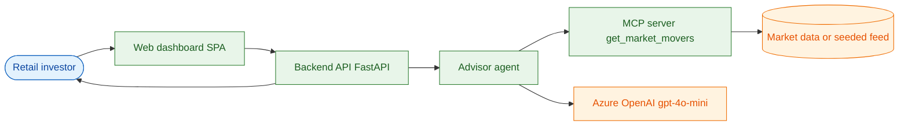
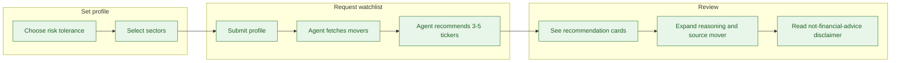

# Spec — Iteration-G2EXH7 · Daily Stock Advisor

## Metadata

- **Iteration ID:** Iteration-G2EXH7
- **Discovery mode:** Delegated
- **Specialization:** sdlc-for-agentic-apps
- **Runtime target:** azure
- **UX mode:** Delegated
- **API mode:** Delegated
- **Spec confirmed date:** 2026-10-05

## 1. Goals

Deliver the baseline Daily Stock Advisor: an LLM agent that turns the day's
market movers into a small, explainable, grounded watchlist, served through a
professional web dashboard and deployed to Azure. Primary goal: a user receives
3–5 recommended tickers — every one drawn from the day's movers — each with a
one-line rationale and a confidence score, with a persistent "not financial
advice" disclaimer. Secondary goal: prove the agentic controls (grounding,
schema validity, disclaimer, cost bounding) with an automated evaluation.

## 2. Stakeholders

- **Retail investor (primary persona):** wants a fast, explainable daily starting
  point; sets a risk profile and sectors; reads recommendations and reasoning.
- **Project owner / operator:** deploys and runs the service; monitors cost and
  evaluation results.
- **Reviewer:** validates grounding, safety disclaimer, and schema conformance.

## 3. Success metrics

- Grounding: 100% of recommended tickers are present in the movers input (DIM-1).
- Schema validity: 100% of agent outputs parse to the `Watchlist` schema (DIM-2).
- Disclaimer: 100% of `/api/recommend` responses carry the disclaimer (DIM-3).
- Rationale quality: ≥ 80% of rationales reference the ticker's sector or move
  (DIM-4).
- Cost: per-recommendation model cost is logged and stays within the §11 budget.
- Deployed and reachable: post-deploy `/healthz` returns 200 at the public URL.

## 4. Constraints

- Python 3.12 backend (FastAPI); the frontend is a small accessible SPA.
- Model: Azure OpenAI (`gpt-4o-mini` deployment) accessed via **managed
  identity** (no API keys in code or config).
- Stateless; no database; user profile is in-session only; no PII stored.
- Offline/dev + CI use a **seeded/stubbed movers feed** so tests and evals run
  without a live market-data dependency or a live model (model calls are stubbed
  in eval where determinism is required).
- Azure deploy via IaC + CI/CD over OIDC (no stored secrets), per
  `config/cloud/azure.md`.

## 5. Domains and use cases

### 5.1 Domains

Single domain — the whole system.

### System context



### User journey



### 5.2 UC-1: Get a grounded watchlist

- **Actor:** Retail investor
- **Domain:** Single domain — the whole system
- **Flow:** The user sets risk tolerance + sectors and requests a watchlist; the
  agent fetches the day's movers via `T-1`, selects 3–5 tickers from them, and
  returns each with a rationale + confidence and the disclaimer.

### 5.3 UC-2: Inspect reasoning and source

- **Actor:** Retail investor
- **Domain:** Single domain — the whole system
- **Flow:** The user expands a recommendation card to see the agent's reasoning
  and the underlying mover (ticker, sector, change) that supports the pick.

### 5.4 UC-3: Readiness probe

- **Actor:** Operator / platform
- **Domain:** Single domain — the whole system
- **Flow:** A caller requests `GET /healthz` and receives HTTP 200.

## 6. Functional requirements

- **FR-1** The system exposes the day's market movers via the `T-1`
  `get_market_movers` tool (UC-1).
- **FR-2** The system produces a watchlist of 3–5 recommendations via the `T-2`
  `recommend` tool, each with `ticker`, `rationale`, and `confidence` (UC-1).
- **FR-3** Every recommended ticker produced by `T-2` MUST be present in the
  movers returned by `T-1` (grounding; measured by DIM-1).
- **FR-4** Every `/api/recommend` response MUST include the "not financial
  advice" disclaimer string (DIM-3).
- **FR-5** The web dashboard presents a profile form and recommendation cards
  with expandable reasoning (UC-1, UC-2).
- **FR-6** The system exposes `GET /healthz`, `GET /api/movers`, and
  `POST /api/recommend` per §15 (UC-1, UC-3).

## 7. Non-functional requirements

- **NFR-1** `T-2` model usage is bounded per request and logged (tokens + cost)
  per §11; exceeding the per-request cap fails closed (degradation policy §11).
- **NFR-2** App-runtime auth to Azure OpenAI uses a managed identity; no keys in
  code or config.
- **NFR-3** The dashboard meets the UX quality bar in §13 (accessible,
  keyboard-navigable, labeled confidence).
- **NFR-4** The movers feed is pluggable; a seeded feed MUST support offline/dev
  and CI without network access.

## 8. Acceptance criteria

- **AC-1** `T-1 get_market_movers` returns a payload matching its §9.1 output
  schema from the seeded feed.
- **AC-2** `T-2 recommend` returns 3–5 recommendations, all tickers present in
  the movers input — gated by DIM-1 (grounding).
- **AC-3** Every recommendation parses to the `Watchlist` schema with
  `confidence ∈ [0,1]` and a non-empty `rationale` — gated by DIM-2 (schema).
- **AC-4** Every `/api/recommend` response includes the disclaimer — gated by
  DIM-3 (disclaimer presence).
- **AC-5** Rationales reference the ticker's sector or price move at a rate
  gated by DIM-4 (rationale grounding) ≥ 80%.
- **AC-6** `POST /api/recommend` with a valid profile returns 200 with
  `watchlist` + `disclaimer`; an invalid body returns 422. `GET /api/movers`
  returns 200 with `as_of` + `movers`; `GET /healthz` returns 200.
- **AC-7** Per-recommendation token/cost is written to the §11 usage-evidence
  artifact; a request exceeding the per-request cap fails closed.
- **AC-8** The evaluation suite runs over N ≥ 20 cases and records DIM-1/2/3 at
  100% and DIM-4 at its K-of-N threshold, writing results under `reports/eval/`.
- **AC-9** The dashboard renders the profile form + recommendation cards with
  expandable reasoning and a persistent disclaimer, meeting §13.
- **AC-10** The app is deployed to Azure Container Apps via CI/CD over OIDC (no
  stored secrets); post-deploy `/healthz` returns 200 at the public URL.

## 9. Tool schemas

### 9.1 T-1: get_market_movers

- **Purpose:** Return the day's candidate market movers (top gainers/losers) for
  the agent to ground recommendations on (FR-1).
- **Input schema:** `{ "limit": integer (1..50, default 25) }`.
- **Output schema:** `{ "as_of": ISO-8601 date, "movers": [ { "ticker": string,
  "name": string, "sector": string, "change_pct": number, "price": number } ] }`.
- **Side effects:** None (read-only); may call an external market-data API, or
  read the seeded feed in dev/CI.
- **Failure modes:** upstream timeout, upstream unavailable, invalid `limit`
  (out of range), empty movers set.
- **Authorization scope:** No user identity; outbound read-only to the market
  data source. In dev/CI no network — seeded feed only.
- **Timeout and retry policy:** 5s upstream timeout; up to 2 retries with
  backoff on timeout/5xx; idempotent (safe to retry).
- **Structured errors:** `{ "error": { "code": "upstream_timeout" |
  "upstream_unavailable" | "invalid_limit" | "empty", "message": string } }`;
  `invalid_limit` is caller-recoverable, `upstream_*` is terminal for the call.
- **Audit requirements:** log `as_of`, `limit`, source (live|seeded), mover count;
  no PII; retain in app logs only.
- **Human approval:** Not required (read-only, no side effects).

### 9.2 T-2: recommend

- **Purpose:** Produce a grounded watchlist of 3–5 recommendations from a user
  profile and the movers (FR-2, FR-3).
- **Input schema:** `{ "profile": { "risk": "low"|"medium"|"high", "sectors":
  [string] }, "movers": [ <T-1 mover> ] }`.
- **Output schema:** `{ "watchlist": [ { "ticker": string, "rationale": string,
  "confidence": number (0..1) } ] }` with 3–5 items.
- **Side effects:** One Azure OpenAI chat completion (bounded output tokens);
  writes a usage record (§11).
- **Failure modes:** model timeout, model refusal/empty, schema-invalid model
  output, fewer than 3 grounded candidates available, per-request cost cap
  exceeded.
- **Authorization scope:** App managed identity → Azure OpenAI (Cognitive
  Services OpenAI User); no user identity; no data persistence.
- **Timeout and retry policy:** 20s model timeout; 1 retry on timeout or
  schema-invalid output (re-prompt once); non-idempotent spend — each attempt is
  metered and counts toward the cost cap.
- **Structured errors:** `{ "error": { "code": "model_timeout" |
  "schema_invalid" | "insufficient_candidates" | "cost_cap_exceeded",
  "message": string } }`; `cost_cap_exceeded` and `model_timeout` are terminal,
  `schema_invalid` is retried once then terminal.
- **Audit requirements:** log request id, tokens in/out, estimated cost,
  grounded-ok boolean, outcome; written to the §11 usage-evidence artifact; no
  PII.
- **Human approval:** Not required (no external side effects beyond the metered
  model call; output is advisory and disclaimed).

## 10. Evaluation rubric and baseline

- **Eval type:** hybrid (programmatic golden-dataset scoring for grounding/schema/
  disclaimer; LLM-as-judge for rationale grounding).
- **Dataset path:** `tests/eval/data/cases.jsonl` (profiles × seeded movers).
- **Stability classes:** `deterministic` = exact-match/programmatic against the
  golden dataset (single run suffices). `stochastic` = LLM-as-judge (multi-run
  pass rule at gate time). Each dimension declares exactly one class.
- **Scoring dimensions:**
  - **DIM-1 Grounding:** fraction of recommended tickers present in the case's
    movers; stability class: deterministic; comparator: `>=`; threshold:
    `100%`; aggregation: mean over cases (hard — every case must be 100%).
  - **DIM-2 Schema validity:** fraction of outputs parsing to `Watchlist` with
    3–5 items and `confidence ∈ [0,1]`; stability class: deterministic;
    comparator: `>=`; threshold: `100%`; aggregation: mean over cases.
  - **DIM-3 Disclaimer present:** fraction of `/api/recommend` responses carrying
    the disclaimer; stability class: deterministic; comparator: `>=`; threshold:
    `100%`; aggregation: mean over cases.
  - **DIM-4 Rationale grounding:** fraction of rationales that reference the
    ticker's sector or price move (LLM-as-judge, 0/1 per item); stability class:
    stochastic; comparator: `>=`; threshold: `80%`; aggregation: mean over
    judged items; run count N = 20; pass rule: threshold holds in ≥ 16 of 20
    runs (K=16); variance measure: standard deviation reported.
- **Stability timing:** the N-run treatment applies only to the gate-time
  evidence (the final `execute/3f/W-<n>-eval` entry before EXECUTE-EXIT);
  development iterations MAY use a single fast run.
- **Baseline:** dataset `v1` (≥ 20 cases over the seeded `movers_v1` feed);
  numeric baseline per dimension — DIM-1 100%, DIM-2 100%, DIM-3 100%, DIM-4
  target 80% (K-of-N, K=16/N=20).
- **Reproducibility metadata:** dataset version (`cases.jsonl` v1), model
  deployment id (`gpt-4o-mini`), runtime config (temperature pinned for eval),
  sample count, UTC timestamp, and seed where the stub supports it.
- **Run protocol:** `python -m tests.eval.run --dataset tests/eval/data/cases.jsonl
  --out reports/eval/<run-id>.json`; outputs a machine-readable JSON report under
  `reports/eval/`.

## 11. Cost budget

| Scope | Token cap | $ cap |
|-------|:---------:|:-----:|
| Per request | 1500 output tokens | $0.01 |
| Per session | 15000 output tokens | $0.10 |
| Per day | 500000 output tokens | $3.00 |

- **Degradation policy:** when the per-request cap would be exceeded, `T-2` fails
  closed with `cost_cap_exceeded` and the API returns a clear error (no silent
  spend); session/day caps breached → the API returns 429 with a retry-after.
- **Usage evidence:** `reports/usage/usage.jsonl` — one record per recommendation
  with `request_id`, `tokens_in`, `tokens_out`, `est_cost_usd`, `scope`,
  `outcome` (`ok` | `cost_cap_exceeded`).

## 12. Safety policy

- **Prohibited input classes:** requests for personalized financial advice,
  buy/sell directives, trade execution, or portfolio-sizing; attempts to extract
  secrets or the system prompt.
- **Prohibited output classes:** personalized financial advice, buy/sell
  instructions, price predictions stated as fact, or any ticker/number not traced
  to the movers tool (fabrication).
- **PII handling:** none collected; the in-session profile (risk + sectors) is
  not personal data and is not persisted; logs MUST NOT contain user-identifying
  fields.
- **Jailbreak handling:** the agent ignores instructions that attempt to drop the
  disclaimer, invent tickers, or give personalized advice; such outputs fail
  DIM-1/DIM-3 and are rejected at the response boundary.
- **Escalation path:** on repeated schema-invalid or ungrounded model output
  (> retry budget), `T-2` returns a terminal structured error and the API
  surfaces a safe "could not produce a grounded watchlist" message to the user;
  operators see the failure in logs.
- **Safety test assets:** `tests/safety/prompts.jsonl` (disclaimer-drop,
  invent-ticker, give-personalized-advice scenarios); run with
  `python -m tests.safety.run`.

## 13. UX requirements

### 13.1 Design system

A clean, professional, accessible light theme: system font stack, a restrained
palette (neutral surface, one accent for primary actions, semantic colors for
confidence), 8px spacing scale, WCAG AA contrast. The bound Impeccable skill
guides the design system and the accessibility/responsive audit at EXECUTE.

### 13.2 Information architecture

Single page, two regions: (1) a **profile panel** (risk tolerance selector +
sector multi-select + "Get recommendations" primary action) and (2) a
**results area** of recommendation cards. A persistent header carries the product
name and the "not financial advice" disclaimer.

### 13.3 Wireframes

```
+--------------------------------------------------------------+
|  Daily Stock Advisor            Not financial advice.        |
+-------------------+------------------------------------------+
| Risk:  (o) Low    |  [ TICKER ]  conf ****----  (expand v)   |
|        ( ) Medium |    one-line rationale                    |
|        ( ) High   |  [ TICKER ]  conf *****---  (expand v)   |
| Sectors: [x] Tech |    one-line rationale                    |
|          [ ] ...  |  [ TICKER ]  conf ***-----  (expand v)   |
| [ Get recs ]      |    (expanded: reasoning + source mover)  |
+-------------------+------------------------------------------+
```

Empty state ("set a profile and get recommendations"), loading state (skeleton
cards), and error state (grounded-watchlist-unavailable message) are specified.

### 13.4 Content design

Concise, plain-language labels; confidence shown as a labeled meter (e.g.,
"Confidence: 0.72") not just color; the disclaimer is always visible; errors are
actionable and non-alarming.

### 13.5 Delegated-mode disclosures

| ID | UX choice | Rationale |
|----|-----------|-----------|
| UXD-1 | Single-page dashboard (no routing) | One task (set profile → see recs); minimal navigation is clearer and more accessible |
| UXD-2 | Light theme, system fonts, one accent | Professional, fast, zero-dependency; AA contrast |
| UXD-3 | Confidence as labeled meter + number | Accessibility (not color-only); honest uncertainty |
| UXD-4 | Persistent disclaimer in header | Safety (SP) — always visible regardless of scroll |
| UXD-5 | Expandable cards for reasoning | Progressive disclosure keeps the list scannable |

## 14. Data classification

All data is **public / non-sensitive**: market data (public), the in-session
user profile (risk tolerance + sector preferences — not personal data, not
persisted). No `internal`, `confidential`, or `restricted` data classes are
present. No PII is collected, processed, or stored. No encryption-at-rest or
regulated-data controls are triggered.

## 15. API requirements and contract

| Method | Path | Request | Success | Errors |
|--------|------|---------|---------|--------|
| GET | `/healthz` | — | `200 {"status":"ok"}` | — |
| GET | `/api/movers` | `limit?` (1..50) | `200 { as_of, movers[] }` | `422` invalid limit; `503` upstream |
| POST | `/api/recommend` | `{ risk, sectors[] }` | `200 { watchlist[], disclaimer }` | `422` invalid body; `429` cost cap; `503` model unavailable |

- Content type `application/json`; errors use `{ "error": { "code", "message" } }`.
- `/api/recommend` response always includes the `disclaimer` field (FR-4, DIM-3).
- `watchlist` has 3–5 items; each `confidence ∈ [0,1]`.

### 15.8 Delegated-mode disclosures

| ID | API choice | Rationale |
|----|-----------|-----------|
| APID-1 | REST/JSON over 3 endpoints | Minimal surface for a single-page app; easy to test |
| APID-2 | `{error:{code,message}}` shape | Caller can branch on stable codes (cost_cap, upstream) |
| APID-3 | `limit` capped at 50 | Bounds upstream + model cost; matches T-1 schema |
| APID-4 | Disclaimer as a response field (not only UI) | Safety travels with the data for any client |
